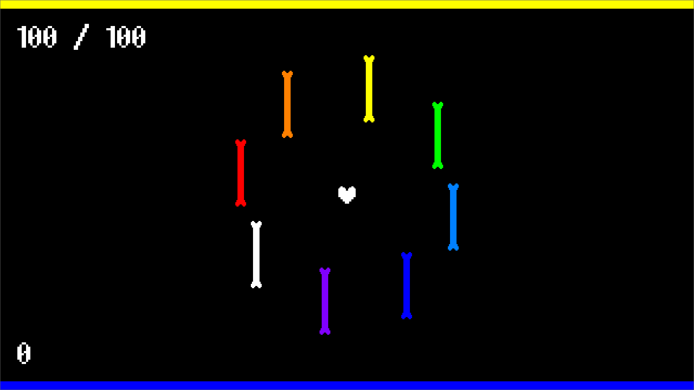

# Undertale - Battle



## Description

This is an Undertale fan game project focusing on turn-based battles, developed using the Godot game engine. The game is inspired by the combat mechanics of Undertale, with a twist of our own.

## Features

- Turn-based battles with unique mechanics
- Pixel art graphics and animations

## Installation

1. Clone the repository:

   ```bash
   git clone https://github.com/sultansagitov/UndertaleBattle.git
   ```

2. Open the project.godot file in Godot Engine.

## Usage

- Navigate through battles using arrow keys or WASD.
- Use abilities, and progress through the story.
- Customize characters and abilities in the game's menu.

## Used items

- Godot 4.1.3.stable.mono
- [Abaddon font](https://caffinate.itch.io/abaddon)
